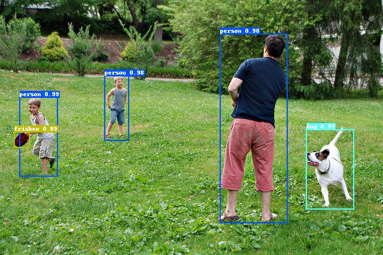
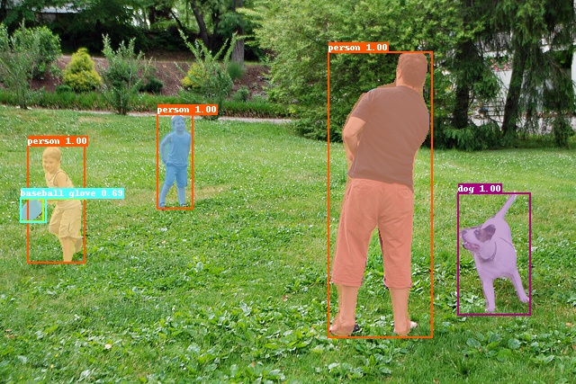

## 1.2 目标检测和实例分割

### 1.2.1 目标检测

如下图所示，给定一张图片，目标检测的任务是通过算法计算出图片中所有目标的位置，并给出每个目标的具体类别。通常用矩形框来表示目标的位置，该框需紧凑地包围住目标的全部范围。

目前基于卷积神经网络的目标检测方法大致可分类两类：

1. 二阶段检测器
2. 一阶段检测器

二阶段检测器，顾名思义，整个检测过程包括两个阶段。第一阶段，从图片中提取出各个目标可能存在的区域，这些区域称为候选框；第二阶段对各个候选框内的目标进行分类和框位置的回归。最终检测器得到每个候选框属于每个目标类别的得分，以及每个候选框针对每个类别微调后的位置。经典的模型包括Faster R-CNN、Cascade R-CNN等。

一阶段检测器，跳过了候选框提取这一步骤，让网络直接输出各目标的位置和类别信息。经典的模型包括YOLO v3、SSD等。

两类目标检测方法相对比，通常二阶段检测器的精度更高，但二阶段检测器对每个候选框都需要进行分类和回归，算法耗时较长。因此用户在选择检测方法时，可以根据自己的需求，在精度和性能上进行平衡。

### 1.2.2 实例分割

实例分割的任务是在目标检测的基础上，计算出各个目标框内，属于目标的像素点，如下图所示。

目前在PaddleDetection中，提供了经典的实例分割方法Mask R-CNN。